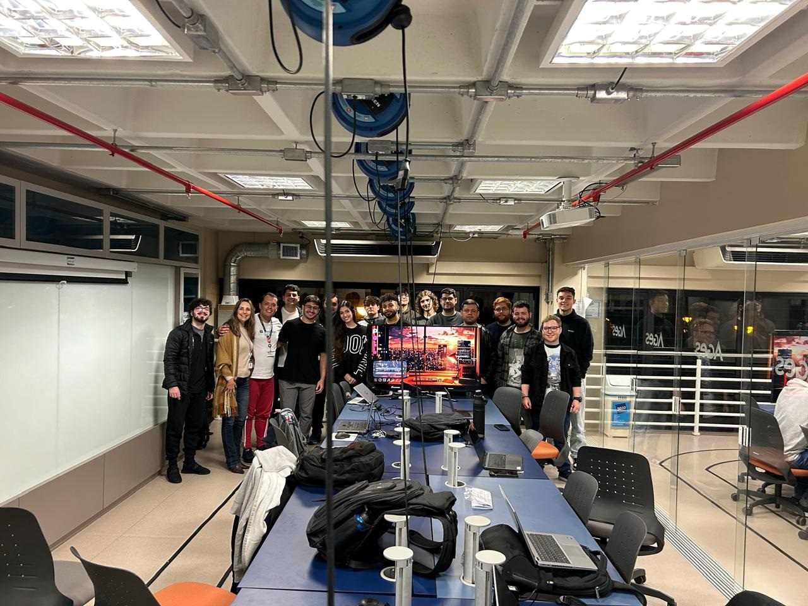

# 🎓 Polymathech

Plataforma web de estudos direcionados que ajuda estudantes a explorar diferentes carreiras através de testes vocacionais, conteúdo interativo e orientação profissional — com uma linguagem jovial, clara e acessível para todos os públicos.

Projeto desenvolvido ao longo de quatro semestres (AGES I a IV) na disciplina de Ambiente de Graduação em Engenharia de Software (AGES) da PUCRS, em parceria com stakeholders reais.

🏆 **Projeto Destaque AGES 2024/1**

## ✨ Sobre o projeto

O objetivo é oferecer uma experiência de aprendizado focada, contextualizando diferentes carreiras de forma envolvente e autêntica, com ferramentas facilitadoras e orientações profissionais para o estudante.

## 🧱 Estrutura do repositório

```
polymathech/
├── backend/    API em NestJS + Prisma + PostgreSQL
├── frontend/   Aplicação web em React + TypeScript
└── docs/       Documentação do projeto (arquitetura, banco de dados, sprints, mockups)
```

## 🚀 Tecnologias

| Camada           | Stack                                              |
| ---------------- | --------------------------------------------------- |
| Front-end        | React, TypeScript, Vite                             |
| Back-end         | NestJS, TypeScript, Prisma                          |
| Banco de dados   | PostgreSQL                                          |
| Infraestrutura   | Docker, AWS (EC2)                                   |
| Arquitetura      | Arquitetura em Camadas + DDD (Domain-Driven Design) |

## 📦 Rodando o projeto localmente

### Pré-requisitos

- [Node.js](https://nodejs.org) (LTS)
- [Docker](https://www.docker.com/) (recomendado, para o banco de dados)
- [PostgreSQL](https://www.postgresql.org/) (caso não use Docker)

### Backend

```bash
cd backend
npm install
cp .env.example .env   # preencha as variáveis (JWT, banco, e-mail)

# sobe o banco via Docker (a partir da raiz do backend)
docker-compose up -d

# aplica as migrações do Prisma
npx prisma migrate dev

# inicia a API em modo dev
npm run start:dev
```

A API por padrão sobe na porta definida em `PORT` no `.env` (`3333`).

### Frontend

```bash
cd frontend
npm install
cp .env.example .env   # aponte VITE_APP_API_URL/PORT para o backend

npm run dev
```

## 🗄️ Banco de dados

O modelo relacional gira em torno de alunos (`Student`), cursos (`Course`), testes vocacionais (`Test`) compostos por questões (`Question`), categorizadas por tipos de inteligência (`IntelligenceType`), com os resultados dos alunos armazenados em `TestResult`. Detalhes completos do modelo estão em [`docs/Banco-de-Dados.md`](docs/Banco-de-Dados.md).

## 📚 Documentação

A pasta [`docs/`](docs) reúne a documentação produzida ao longo do projeto:

- [`arquitetura.md`](docs/arquitetura.md) — arquitetura de frontend, backend e infraestrutura AWS
- [`Banco-de-Dados.md`](docs/Banco-de-Dados.md) — modelo entidade-relacionamento e explicação das entidades
- [`design_mockups.md`](docs/design_mockups.md) — link do Figma com os mockups
- [`processo.md`](docs/processo.md) e [`gerencia.md`](docs/gerencia.md) — organização do time e processo de trabalho
- [`Sprints.md`](docs/Sprints.md) — histórico de sprints e squads
- [`configuracao.md`](docs/configuracao.md) — guia detalhado de configuração do ambiente

## 👥 Equipe



Projeto desenvolvido por sucessivas turmas de AGES da PUCRS (AGES I a IV), com orientação da Profa. Cristina Nunes. A lista completa de participantes está em [`docs/home.md`](docs/home.md).

---

Repositório original hospedado no GitLab da PUCRS ([tools.ages.pucrs.br](https://tools.ages.pucrs.br)); espelhado aqui para portfólio.
