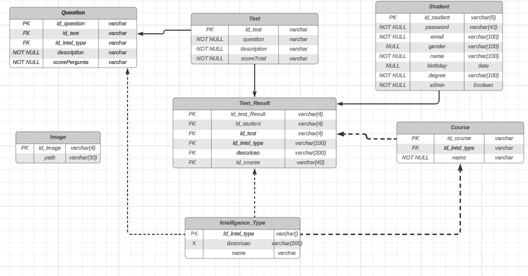
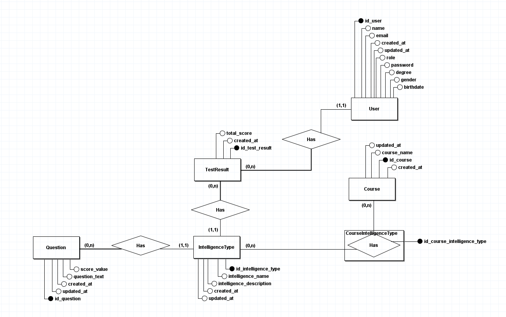
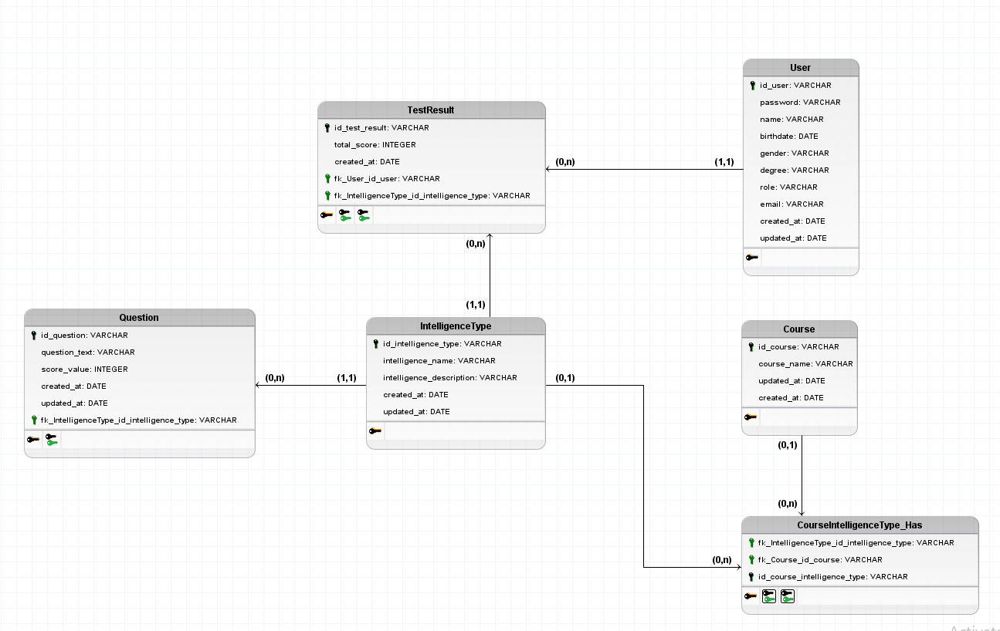

| [Home](home) |[Sprints](Sprints) | [**Escopo**](escopo) | [Processo](processo) | [Design/Mockups](design_mockups) | [Configuração](configuracao) | [Arquitetura](arquitetura) | [Gerência](gerencia) | [Código](codigo) | [BD](Banco de Dados) | [Qualidade](qualidade) | [Frontend](frontend) | [Backend](backend) | [Analytics](analytics)
| :----------: |:---------: |:-------------------------------: | :------------------: | :--------------: | :--------------------------: | :--------------------: | :------------------------: | :--------------: | :---------------: | :--------------------: | :---------------: | :--------------------: | ------------: |

# Modelo Inicial

# Modelo Atualizado

# EXPLICAÇÃO DO BANCO DE DADOS
Esta estrutura de banco de dados é central para a funcionalidade da Polymathech. Ela suporta a administração de testes, o armazenamento e recuperação de questões, o gerenciamento de perfis de alunos e a categorização inteligente do conteúdo dos testes e resultados. Esta documentação serve como um guia para compreender o esquema do banco de dados e para o desenvolvimento ou manutenção adicional da plataforma.

## Entidades e Atributos
**Entidade Student**

*Função Primária*: Mantém os dados de indivíduos que estão registrados no sistema.

*Atributos*: ID do aluno, senha, email, gênero, nome, data de nascimento, grau de instrução e uma marcação administrativa que denota se o aluno possui direitos administrativos.

## Entidade Course

*Função Primária*: Representa os vários cursos oferecidos nos quais os alunos podem se matricular.

*Atributos*: ID do curso e nome do curso.

## Entidade Test

*Função Primária*: Representa testes associados a diferentes cursos.

*Atributos*: ID do teste, referência da questão, texto descritivo e a pontuação total alcançável.

## Entidade Question

*Função Primária*: Armazena questões individuais que compõem um teste.

*Atributos*: ID da questão, ID do teste correspondente, ID do tipo de inteligência associado, texto descritivo e a pontuação atribuída à questão.

## Entidade Intelligence Type

*Função Primária*: Categoriza questões e resultados de testes em vários tipos de inteligência, como lógica, verbal, matemática, etc.

*Atributos*: ID do tipo de inteligência, descrição detalhada e nome do tipo de inteligência.

## Entidade Image

*Função Primária*: Armazena imagens que podem ser usadas nas questões ou material relacionado ao teste.

*Atributos*: ID da imagem e o caminho do arquivo até a localização da imagem.

## Entidade Test

*Função Primária*: Mantém um registro dos resultados dos testes realizados pelos alunos.

*Atributos*: ID do resultado do teste, ID do aluno, ID do teste, ID do tipo de inteligência, texto descritivo e ID do curso.

# Relacionamentos

**Teste e Questão**: Uma relação de um para muitos, onde cada teste é composto por várias questões.

**Questão e Tipo de Inteligência**: Cada questão é categorizada sob um tipo específico de inteligência.

**Resultado do Teste**: Reflete as relações de muitos para muitos entre alunos e testes, vinculados através de cursos e categorizados por tipos de inteligência. 