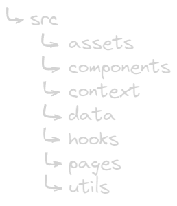
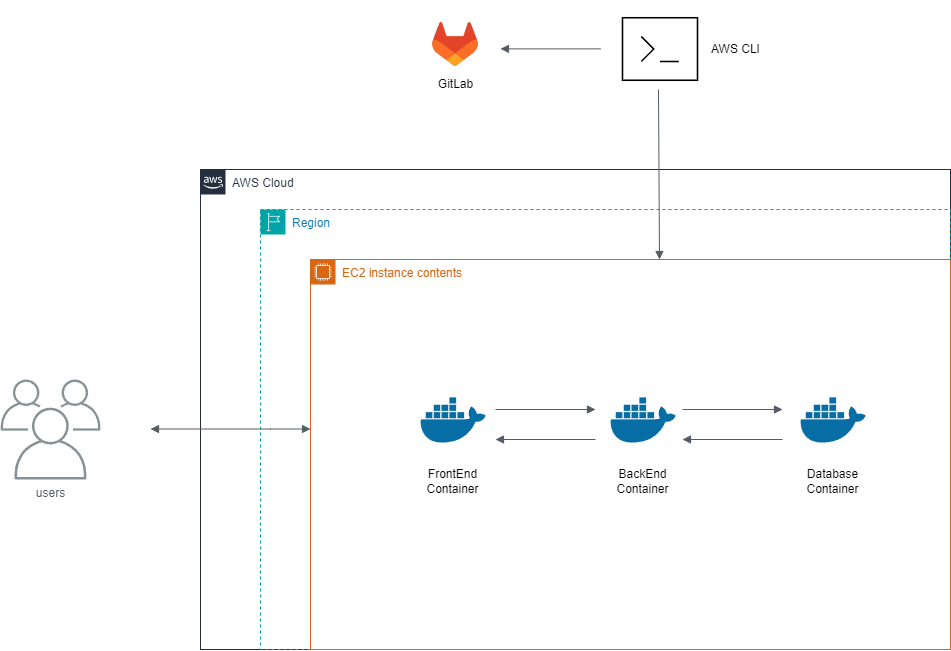

| [Home](home) |[Sprints](Sprints) | [**Escopo**](escopo) | [Processo](processo) | [Design/Mockups](design_mockups) | [Configuração](configuracao) | [Arquitetura](arquitetura) | [Gerência](gerencia) | [Código](codigo) | [BD](Banco de Dados) | [Qualidade](qualidade) | [Frontend](frontend) | [Backend](backend) | [Analytics](analytics)
| :----------: |:---------: |:-------------------------------: | :------------------: | :--------------: | :--------------------------: | :--------------------: | :------------------------: | :--------------: | :---------------: | :--------------------: | :---------------: | :--------------------: | ------------: |

# FrontEnd

## Tecnologias
- Engine: NodeJS
- Linguagem: Typescript
- Framework: ReactJS
- Estilo: CSS

## Estrutura

# BackEnd

## Tecnologias
- Engine: NodeJS
- Linguagem: Typescript
- Framework: NestJS
- Banco de Dados: PostgreSQL

## Estrutura

Arquitetura em Camadas + DDD (Domain Driven Design)

![image](uploads/83f02aefeb6921fa27fdf736d55ec![polymathech-aws]

# AWS

## Arquitetura

Para realizarmos o deploy da aplicação na AWS, optamos por acessar o serviço EC2 através da AWS CLI. Dessa forma, acessamos diretamente a máquina virtual na AWS e configuramos a aplicação de forma manual. 
