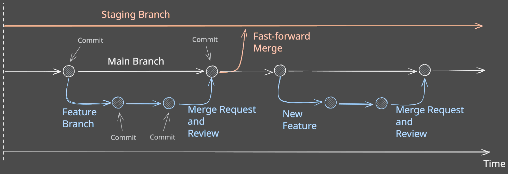

| [Home](home) |[Sprints](Sprints) | [**Escopo**](escopo) | [Processo](processo) | [Design/Mockups](design_mockups) | [Configuração](configuracao) | [Arquitetura](arquitetura) | [Gerência](gerencia) | [Código](codigo) | [BD](Banco de Dados) | [Qualidade](qualidade) | [Frontend](frontend) | [Backend](backend) | [Analytics](analytics)
| :----------: |:---------: |:-------------------------------: | :------------------: | :--------------: | :--------------------------: | :--------------------: | :------------------------: | :--------------: | :---------------: | :--------------------: | :---------------: | :--------------------: | ------------: |

# GitLab Flow

O Gitlab Flow é uma alternativa ao Gitflow, tendo como principais características sua simplicidade, transparência e efetividade. Esse workflow possui como branch principal a branch _Main_, de onde são ramificadas as _Feature Branches_ para o desenvolvimento de novas funcionalidades da aplicação, e possui também uma branch _Staging_ utilizada para o deploy da aplicação em um ambiente de homologação.

Ao finalizar o desenvolvimento de uma nova feature, é aberto um _Merge Request_ de uma _Feature Branch_ para a branch _Main_. O _Merge Request_ só deve ser aprovado após passar por uma revisão e após a conclusão dos testes automatizados. Ao final de cada _Sprint_, é possível gerar uma _tag_ da versão atual da branch _Main_ e então executar um _Fast-forward Merge_ desta branch para a branch _Staging_, recebendo assim a versão mais atualizada da aplicação disponível para ser analisada em um ambiente de homologação.

## Passo-a-passo

### Nomes para Branches
Cada nova branch deve ser aberta a partir da branch _Main_. Sendo assim, para manter o controle do desenvolvimento da aplicação, essas novas branches devem seguir as seguintes nomenclaturas:

- Novas funcionalidades: `feat/<cod-da-US>-<título-da-US>`
- Correção de bug: `bug/<cod-da-US>-<título-da-US>`
- Manutenção ou atualização do código: `chore/<cod-da-US>-<título-da-US>`
- Refatoração: `refactor/<cod-da-US>-<título-da-US>`
- Testes: `test/<cod-da-US>-<título-da-US>`

> Exemplo: feat/US05-AutenticacaoDeUsuarios

### Clonando um repositório
Em sua máquina local, abra um terminal de commando no diretório desejado e insira o seguinte commando:

`git clone <URL-do-repositório>`

> Exemplo: git clone https://tools.ages.pucrs.br/polymathech/polymathech-backend.git

### Atualizando um repositório local
É sempre importante manter o repositório local atualizando, evitando assim muitos problemas indesejados durante o desenvolvimento das atividades. Esse recurso é sempre muito importante antes de serem criadas novas branches. Utilize então o seguinte comando:

`git pull origin main`

> Caso você já esteja trabalhando em uma nova branch, seja ela compartilhada com outros desenvolvedores ou não, e queira atualizá-la em relação ao repositório remoto, é possível utilizar apenas o comando `git pull`.

### Criando uma nova branch
Entre dentro do diretório do repositório recém clonado utilizando um terminal de commando na sua máquina local, e então digite o seguinte commando:

`git checkout -b <nome-da-branch>`

> Exemplo: git checkout -b bug/US19-CorrecaoDosTestesUnitarios

Após criar sua branch, use o seguinte commando para que ela fique disponível na plataforma _Tools_ da Ages:

`git push --set-upstream origin <nome-da-branch>`

> Exemplo: git push --set-upstream origin bug/US19-CorrecaoDosTestesUnitarios

### Commits
Ao realizar modificações importantes no código ou finalizar o desenvolvimento de uma funcionalidade da aplicação, é importante salvar as alterações feitas. Para isso realize um _Commit_ da alterações, ou seja, crie um ponto de controle na 'história' do projeto. Para isso, navegue até a raiz do repositório no qual esteja trabalhando, abra um terminal de commando e siga os seguintes passos:

- Antes de realizar um _commit_, adicione um ou mais arquivos em _staging_ (área para agrupar as alterações a serem salvas). Para isso utilize o comando `git add <nome-do-arquivo>` para adicionar um ou mais arquivos, ou `git add .` para adicionar em _staging_ todos arquivos modificados.

> Exemplo: git add users-repository.ts

- Após adicionar os arquivos em _staging_, acrescente uma mensagem/comentário resumindo as alterações que foram realizadas utilizando o comando `git commit -m "mensagem-sobre-as-modificacoes".

> Exemplo: git commit -m "Adicionando rota para cadastrar um novo usuário"

- Após realizar o _commit_, envie as alterações para o repositório remoto utilizando o comando `git push`.

### Merge Request
Quando o desenvolvimento de uma determinada funcionalidade da aplicação estiver concluída, é necessário que essas alterações sejam enviadas para a branch _Main_ utilizando um _Merge Request_. Para realizar o _Merge Request_ primeiro verifique se não há novos commits na branch _Main_ que não estejam na sua branch. Para isso, utilize os seguintes comandos em sua máquina local:

- Mude para a branch que esteja trabalhando: `git checkout <nome-da-branch>`

> Exemplo: git checkout feat/US04-RotaDeCadastroDeUsuarios

- Verifique se sua branch está atualizada em relação a branch _Main_: `git pull origin main`

> Este comando irá realizar um merge da _Main_ para a sua branch se caso houverem novas informações na branch _Main_ remota. Se caso houverem conflitos, resolva-os manualmente antes de ir para o próximo passo.

- Se existirem alterações, envie elas para sua branch no repositório remoto: `git push`

- Abra o repositório remoto em seu browser, e então realize o _Merge Request_ manualmente.

> As seguintes informações são necessárias para abrir um novo _Merge Request_:
> - Source branch: <nome-da-sua-branch>
> - Target branch: main
> - Título: <código-da-US>:<título-da-US>
> - Descrição: <breve-descrição-da-US>
> - (Opcional) Reviewer: <nome-de-um-aluno-agesIII-ou-agesIV>